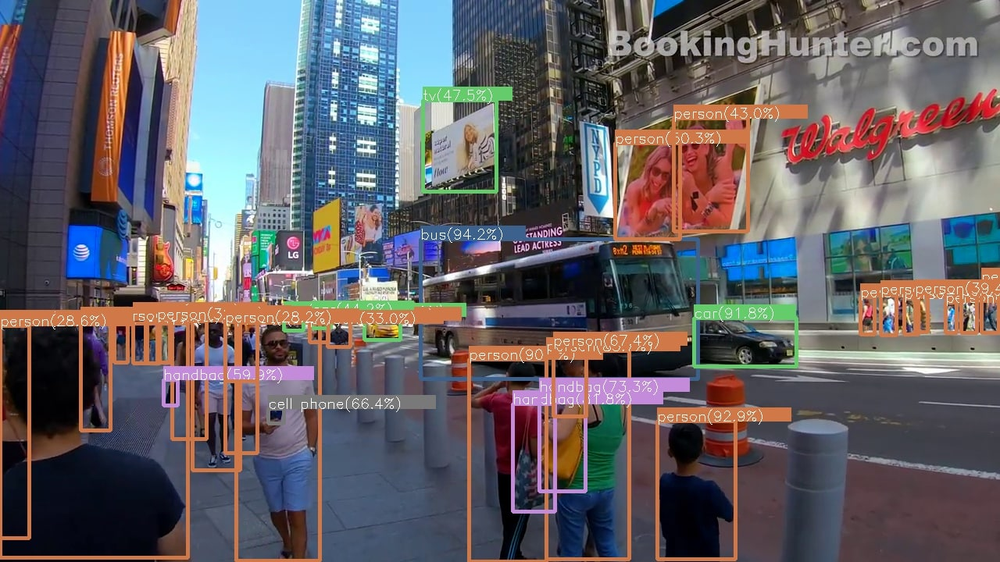

# You Only Look Once (YOLO)
Pytorch-based implementation with structural and algorithmic changes presented in the v4/v5 versions, including Cross Stage Partial modules (CSP), Spatial Pyramid Pooling (SPP), Path Aggregation Network (PAN), Mosaic Augmentation, CIoU-loss, Random training shapes.

## Training and Inference

### References
- [YOLOv4: Optimal Speed and Accuracy of Object Detection](https://arxiv.org/abs/2004.10934)
- https://github.com/AlexeyAB/darknet
- https://github.com/ultralytics/yolov5
